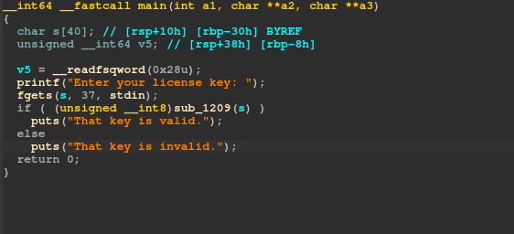
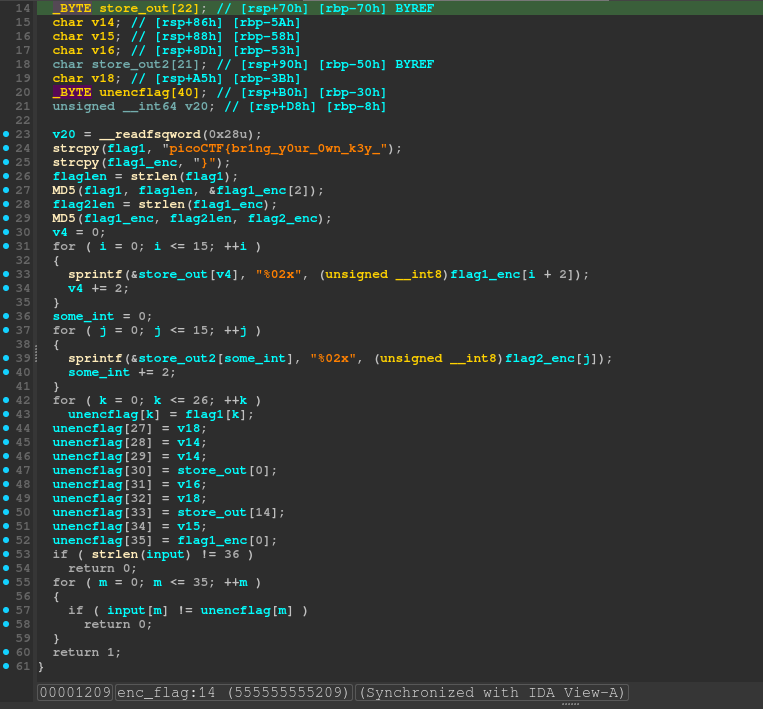
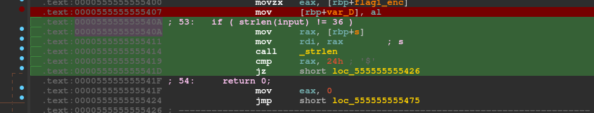

First download the binary: 

```
h4z3@parrot ~/ctf/re/pico/keygenme $ wget https://artifacts.picoctf.net/c/52/keygenme
--2025-12-04 21:34:24--  https://artifacts.picoctf.net/c/52/keygenme
Resolving artifacts.picoctf.net (artifacts.picoctf.net)... 54.230.114.56, 54.230.114.24, 54.230.114.22, ...
Connecting to artifacts.picoctf.net (artifacts.picoctf.net)|54.230.114.56|:443... connected.
HTTP request sent, awaiting response... 200 OK
Length: 14472 (14K) [application/octet-stream]
Saving to: ‘keygenme.1’

keygenme.1                                      100%[=====================================================================================================>]  14.13K  --.-KB/s    in 0s      

2025-12-04 21:34:24 (151 MB/s) - ‘keygenme.1’ saved [14472/14472]

h4z3@parrot ~/ctf/re/pico/keygenme $ 

```

Next we can run the `file` command to get some info about the binary:


```
keygenme.1: ELF 64-bit LSB pie executable, x86-64, version 1 (SYSV), dynamically linked, interpreter /lib64/ld-linux-x86-64.so.2, BuildID[sha1]=054f04db5ac2714c025f015397bec4f65af8e688, for GNU/Linux 3.2.0, stripped
```

So, I can tell from this that its dynamically linked, which means its going to use libraries on my computer, and its stripped so there wont be the luxury of variable or function names, and its going to be harder to debug. 
Next run the strings command: 

```
h4z3@parrot ~/ctf/re/pico/keygenme $ strings keygenme.1
/lib64/ld-linux-x86-64.so.2
mgUa
libcrypto.so.1.1
__gmon_start__
_ITM_deregisterTMCloneTable
_ITM_registerTMCloneTable
libc.so.6
sprintf
puts
__stack_chk_fail
stdin
fgets
strlen
__cxa_finalize
__libc_start_main
OPENSSL_1_1_0
GLIBC_2.4
GLIBC_2.2.5
u+UH
picoCTF{H
br1ng_y0H
ur_0wn_kH
dH34%(
[]A\A]A^A_
%02x
Enter your license key: 
That key is valid.
That key is invalid.
:*3$"
GCC: (Ubuntu 9.4.0-1ubuntu1~20.04.1) 9.4.0
.shstrtab
.interp
.note.gnu.property
.note.gnu.build-id
.note.ABI-tag
.gnu.hash
.dynsym
.dynstr
.gnu.version
.gnu.version_r
.rela.dyn
.rela.plt
.init
.plt.got
.plt.sec
.text
.fini
.rodata
.eh_frame_hdr
.eh_frame
.init_array
.fini_array
.dynamic
.data
.bss
.comment
```

So there's quite a lot of useful info here. I can see it uses `libcrypto.so.1.1` so probably does some encryption on the flag. It also uses `sprintf` which I had not used or heard of until now so I did some googling and found it's essentially the regular `printf` but instead of printing to `stdout` it writes to an character array, and this is useful because of the format specifier. 

Anyway, there's also a partial flag there: `picoCTF{Hbr1ng_y0Hur_0wn_kH`, but is incomplete so I'd assume the rest is going to be harder to find. I'll load it into ida to see what it looks like. 

This is the main function, and you can see that it calls `sub_12_09(s)` with the users input as an arg. 


Next lets check out that func


There's quite a lot of code here and decompiled code isn't the easiest to understand, so I read through it and changed the variable names. 


You don't actually need to understand too much of this unless you want to reverse the encryption process. Notice how on line 57, each character of the users input is compared to a character of an array, and if the users input isn't equal to that of the array, it returns 0 and main will reject the input. At this stage in execution, the flag is being stored in unencrypted format somewhere in memory, and I can find it with gdb. 

Now don't have much experience with either ida or gdb, so I spend a while trying to break the programs execution at the right place, at line 53, and I found it difficult using gdb on a stripped binary. 

What I ended up doing was right clicking that line in ida, and selecting the `copy to assembley` option, which brought me here: 



What I did was grabbed the address `0x000055555555540a` and used it in gdb to add a breakpoint, then print 64 strings (messy but whatever) starting at rsp. This works because when we break at that instruction, the flag has been decrypted and is just sitting in memory. 

```
For help, type "help".
Type "apropos word" to search for commands related to "word"...
Reading symbols from keygenme...
(No debugging symbols found in keygenme)
(gdb) set breakpoint pending on
(gdb) break *0x55555555540A
Breakpoint 1 at 0x55555555540a
(gdb) r
Starting program: /home/julianb/gaff/files/ctf/re/pico/keygenme/keygenme 
[Thread debugging using libthread_db enabled]
Using host libthread_db library "/lib/x86_64-linux-gnu/libthread_db.so.1".
Enter your license key: aaa

Breakpoint 1, 0x000055555555540a in ?? ()
(gdb) x/64s $rsp
0x7fffffffdbe0:	" \320\377\367\377\177"
0x7fffffffdbe7:	""
0x7fffffffdbe8:	"\340\334\377\377\377\177"
0x7fffffffdbef:	""
0x7fffffffdbf0:	"\340\345\276\367\377\177"
0x7fffffffdbf7:	""
0x7fffffffdbf8:	" "
0x7fffffffdbfa:	""
0x7fffffffdbfb:	""
0x7fffffffdbfc:	"\020"
0x7fffffffdbfe:	""
0x7fffffffdbff:	""
0x7fffffffdc00:	"\020"
0x7fffffffdc02:	""
0x7fffffffdc03:	""
0x7fffffffdc04:	"\033"
0x7fffffffdc06:	""
0x7fffffffdc07:	""
0x7fffffffdc08:	""
0x7fffffffdc09:	""
0x7fffffffdc0a:	""
0x7fffffffdc0b:	""
0x7fffffffdc0c:	""
0x7fffffffdc0d:	""
0x7fffffffdc0e:	"}"
0x7fffffffdc10:	"C\202\030\325r\351\001bИ\034\273\307\3248\202˱\204ݎ\005\311p\236]\312\355\252\004\225\317picoCTF{br1ng_y0ur_0wn_k3y_"
0x7fffffffdc4c:	"UU"
0x7fffffffdc4f:	""
0x7fffffffdc50:	"438218d572e90162d0981cbbc7d43882cbb184dd8e05c9709e5dcaedaa0495cfpicoCTF{br1ng_y0ur_0wn_k3y_abb48a6c}\377\177"
0x7fffffffdcb7:	""
0x7fffffffdcb8:	""
0x7fffffffdcb9:	"\316\"Y\370\016\242X\020\335\377\377\377\177"
0x7fffffffdcc7:	""
0x7fffffffdcc8:	"\342TUUUU"
0x7fffffffdccf:	""
0x7fffffffdcd0:	"(\336\377\377\377\177"
0x7fffffffdcd7:	""
0x7fffffffdcd8:	""
0x7fffffffdcd9:	""

```

*Note that `set breakpoint pending on` is **really** useful for doing things like this, I didnt know it existed until this chall, but it saved me a lot of brainache.*

And there it is. `picoCTF{br1ng_y0ur_0wn_k3y_abb48a6c}`
Victory.

Thanks for reading. If I was wrong about something please do lmk, I'm a bit of a noob in re tbh.
